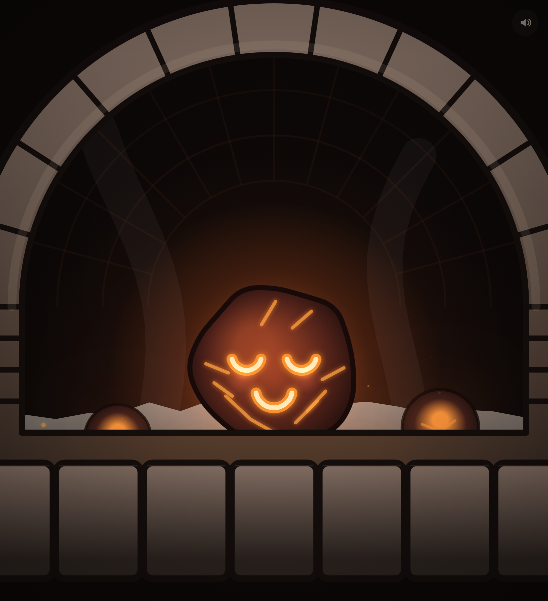

# Ember — a tiny cozy coal pet 🔥

A single-screen digital pet: one little glowing coal living in a stone hearth.
No menus, no stats, no goals — just calm, satisfying play with one very cute
creature who's always happy you came to visit.



## Play

Open `index.html` in any modern browser. That's it — no build step, no
dependencies.

```sh
# or serve it, if your browser is fussy about file:// URLs
python3 -m http.server
# then visit http://localhost:8000
```

## What he does

- **Idle:** sits in the ash with a gentle breathing glow, the cracks in his
  little body softly pulsing. Every so often he does a small spontaneous
  wobble, just to feel alive.
- **Flick him:** click/touch‑drag and release to send him tumbling. He rolls
  with real momentum, bounces off the hearth walls and floor, and **laughs**
  the whole time (squeezed‑shut eyes, open grin) with squash‑and‑stretch on
  every impact. Sparks and little ash puffs burst where he lands.
- **Chain reaction:** if he bumps one of the small embers nestled in the ash,
  it flares up bright — and the warmth ripples out to its neighbours. This is
  the most satisfying thing in the app.
- **He sleeps:** if you leave him be for a while, the embers dim and he curls
  up for a cozy nap (`z z z`). He is *never* lost and never needs saving.
- **Wake him:** the moment you touch or flick him, the whole hearth flickers
  back to life in a ripple of sparks — and he lets you know he missed you.
- **Little notes** drift by in clean, low‑opacity text when you play with him
  ("your little coal is having so much fun!").

A small mute button in the corner toggles the soft ambient fire hum and crackle
(synthesised with the Web Audio API — no audio files).

## Design constraints (intentionally absent)

No hunger/health/happiness meters, no currency or shop, no neglect/death
mechanic, no nagging notifications, no menus. The sleep state is purely cozy
ambience, not a punishment — he's always fine.

## Tech

Plain HTML5 Canvas + a little CSS. Everything — the hearth, the coal, his
face, the physics, the particles, the sound — is drawn and simulated
procedurally in `game.js`. No frameworks, no assets, no bundler.

| File | What it is |
|------|------------|
| `index.html` | The single page + message/mute overlay |
| `styles.css` | Layout, the floating message, the mute button |
| `game.js`   | Scene rendering, physics, the coal, particles, audio |
